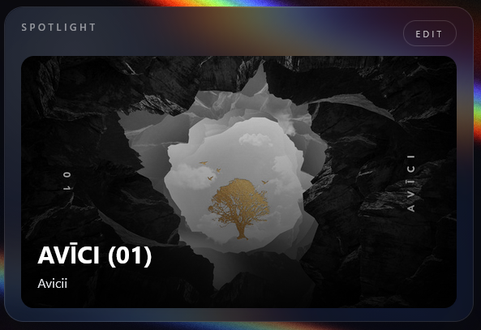
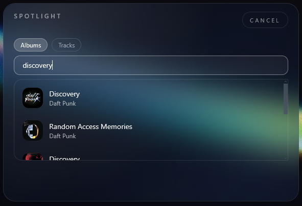
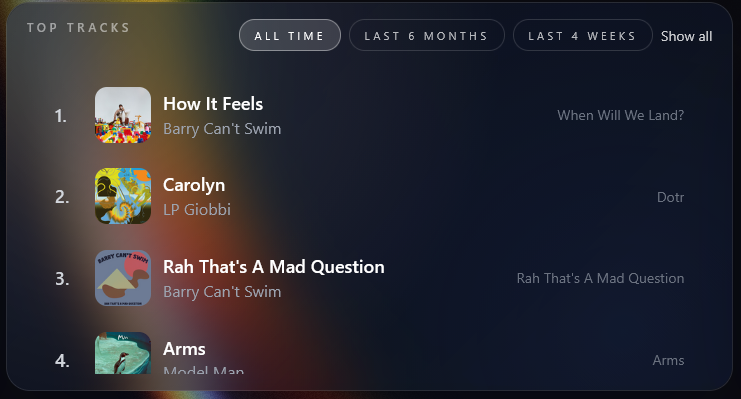
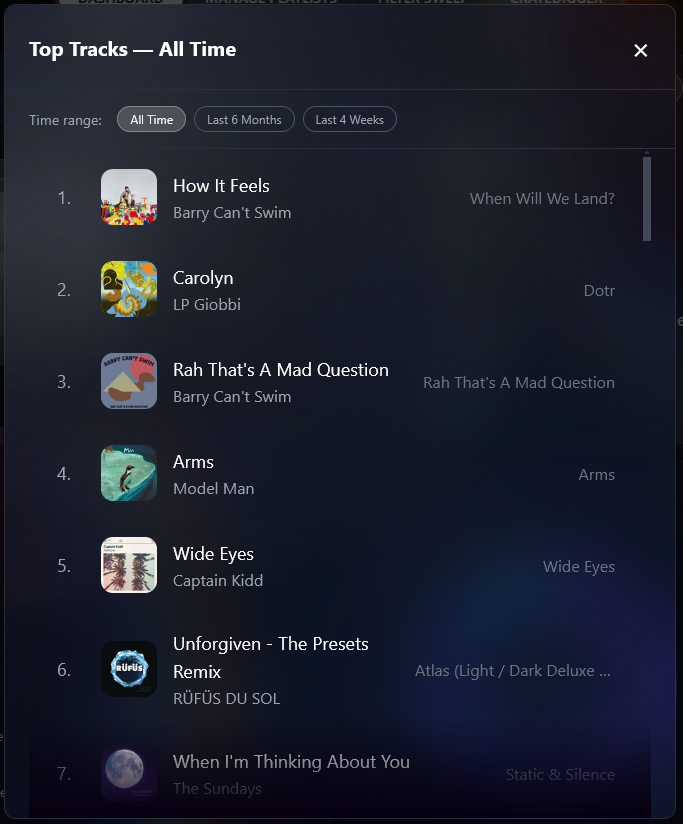
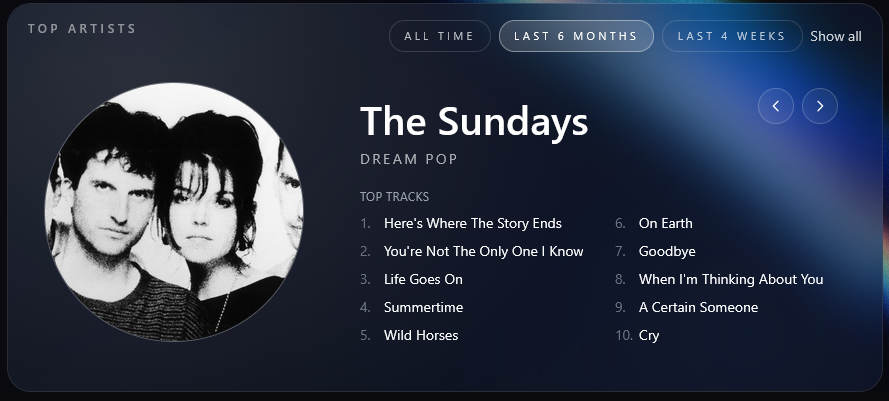
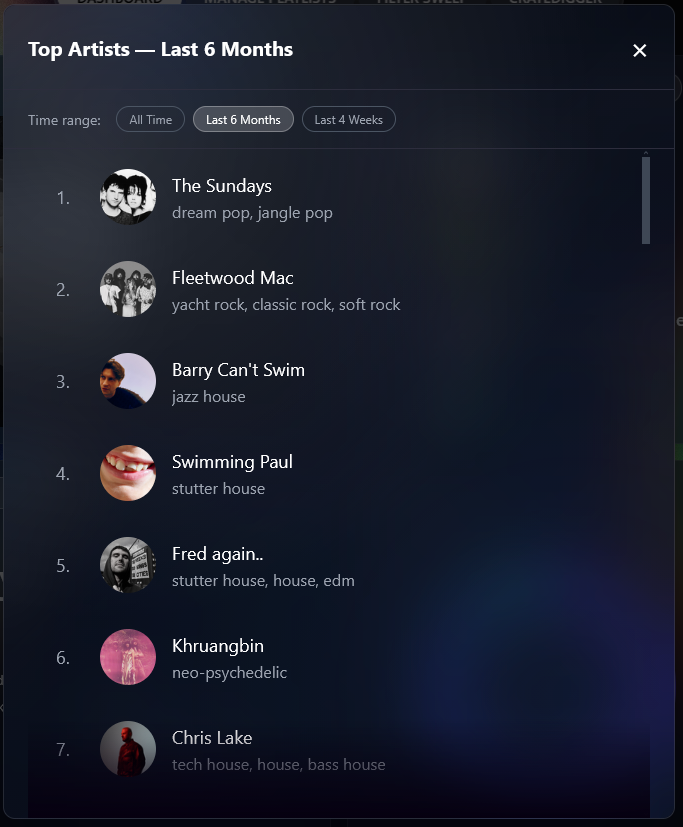
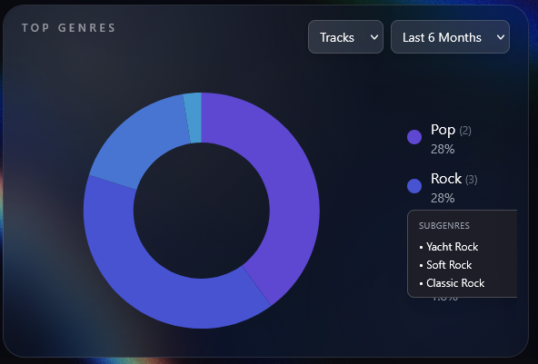
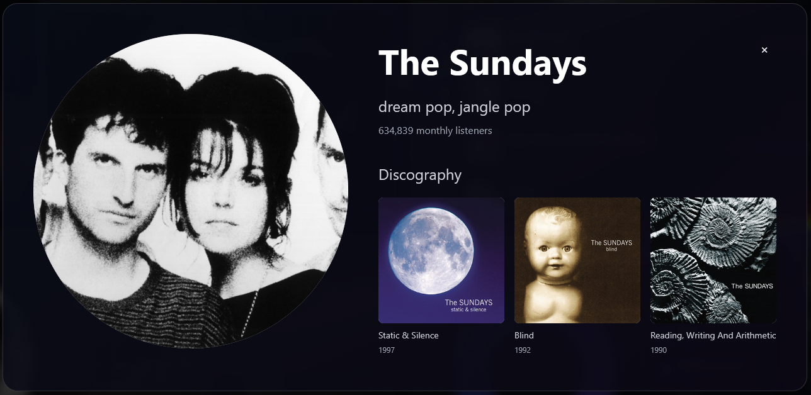
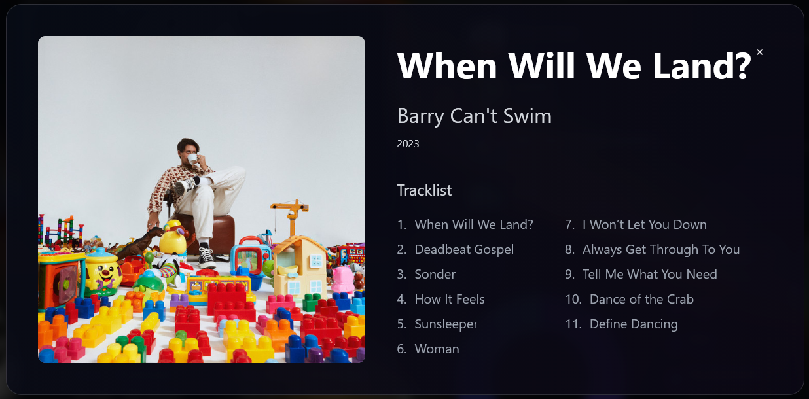

# Dashboard

The Dashboard is your listening stats home base. It pulls your Spotify data across three time ranges and surfaces it in four sections — all in one view.

---

## Sections

### User Profile Card
Displays user's info such as Spotify handle and profile avatar.

---
### Spotlight Card

Allows customization from user to select preferred album/track cover image to display on dashboard. Its purpose is purely cosmetic.

  
  

---

### Top Tracks

Displays your top ten tracks for selected time range (*all time, last 6 months or last 4 weeks*).

Clicking on *Show All* displays up to 50 of your top songs for the selected time range.

Each row displays rank ( *1-50* ), cover image ( *click to open album profile card* ), track name ( *links to Spotify* ), artist name and album name.

---

### Top Artists

Displays up to ten of your most-listened artists for the selected time range ( *last 4 weeks, last 6 months or all time* ).  Scrollable action using arrows displayed on card, or drag-action click. Each slide of each artist displays artist name, genre (if available ) and top ten tracks from Spotify. 

Clicking *Show All* opens up a window displaying up to 50 top artists from selected range.

---

### Top Genres

A breakdown of your genre distribution derived from your top artists and tracks.

Genres are grouped into parent categories (e.g. *"yacht rock"* rolls up into *"rock"*)

Genre card displays:
- Each genre shows its percentage of your total listening
- Subgenres are collapsible
- Displayed as an animated horizontal bar chart
- Toggle the source between **Artists** or **Tracks**

---

### Recently Played

Your last 30 tracks played on Spotify.

Recently played card displays:
- Track name (links to Spotify)
- Artist(s)
- Total listening time shown as an aggregate across all 30 tracks

---

### Extra Features

At any point in the dashboard, clicking on the image of an artist or an album cover will open up a Profile Card.

Each artist card displays:
- Artist name (links to Spotify)
- Artist photo
- Primary genre
- Monthly listener count
- Popularity score (0–100)
- On expand: top 10 tracks by that artist

Each album card displays:
- Album image
- Album name
- Artist name
- Year of release
- Track list

---

### Notes

- All four sections load from a single API call to `/api/user-stats` on page load.
- Switching time ranges does not re-fetch from Spotify — the data for all three ranges is already loaded.
