# Dashboard

The Dashboard is your listening stats home base. It pulls your Spotify data across three time ranges and surfaces it in one view — top artists, top tracks, top genres, and recently played history.

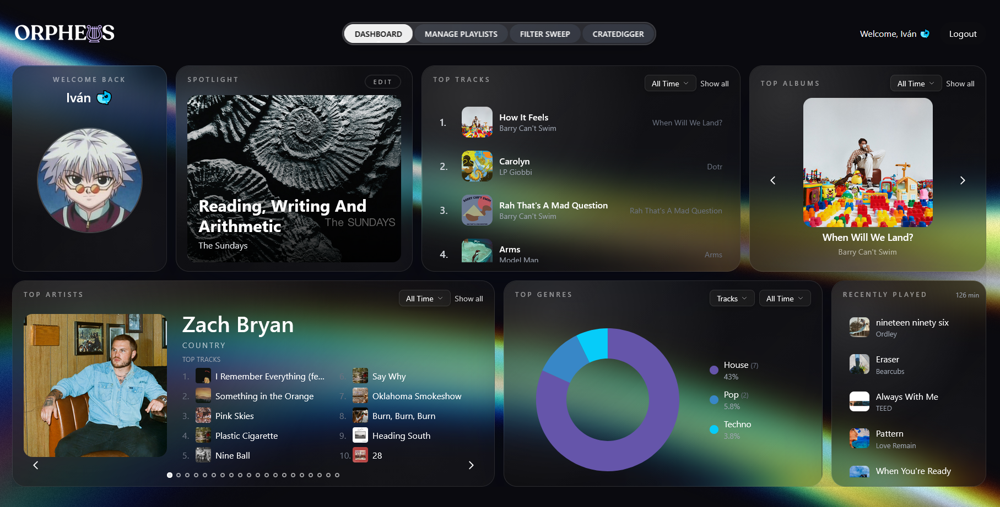

---

## Sections

### User Profile Card

Displays your Spotify handle and profile avatar.

---

### Spotlight Card

A customizable display that lets you choose any album or track cover to feature on your dashboard. Its purpose is purely cosmetic — a personal touch for the top of the page.

  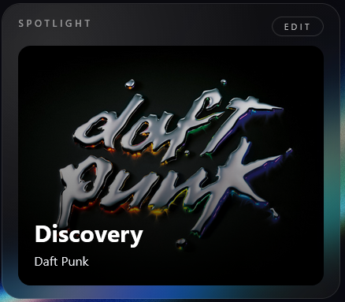
  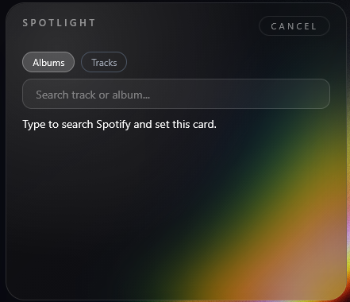

---

### Top Tracks

Displays your top ten tracks for a selected time range — *last 4 weeks, last 6 months, or all time*.

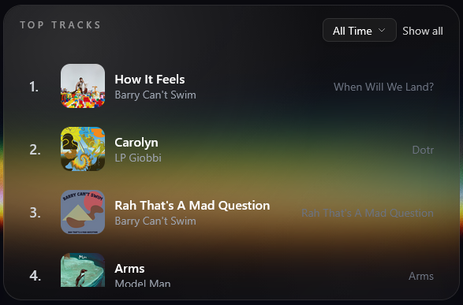

Clicking **Show All** expands the list to up to 50 tracks for the selected range.

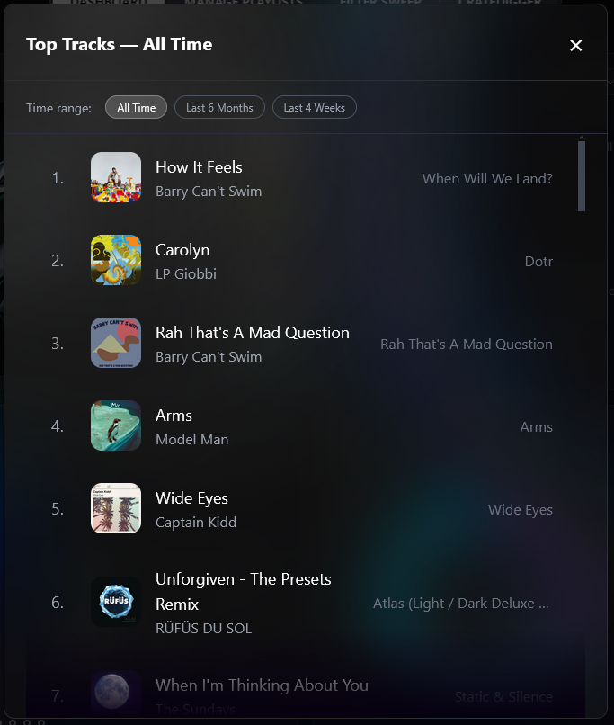

Each row shows:
- Rank (1–50)
- Cover image — click to open the album profile card
- Track name — links to Spotify
- Artist name
- Album name

---

### Top Artists

Displays up to ten of your most-listened artists for a selected time range — *last 4 weeks, last 6 months, or all time*.

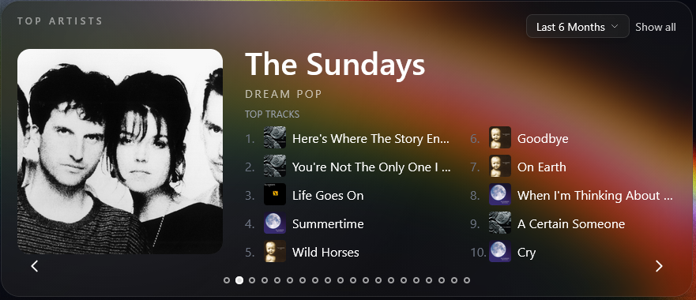

Artists are shown in a scrollable carousel — navigate using the arrows on the card or by clicking and dragging. Each slide shows the artist name, primary genre (if available), and their top ten tracks on Spotify.

Clicking **Show All** opens a window with up to 50 top artists for the selected range.

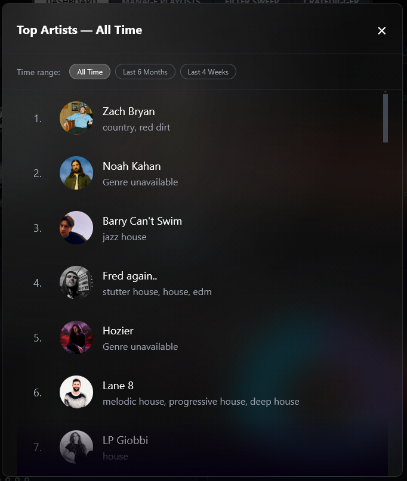

---

### Top Genres

A breakdown of your genre distribution, derived from your top artists and tracks.

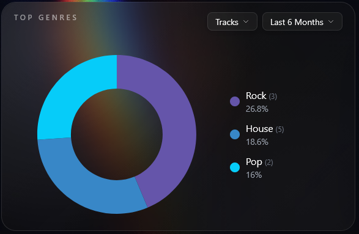

Genres are grouped into parent categories — for example, *"yacht rock"* rolls up into *"rock"*.

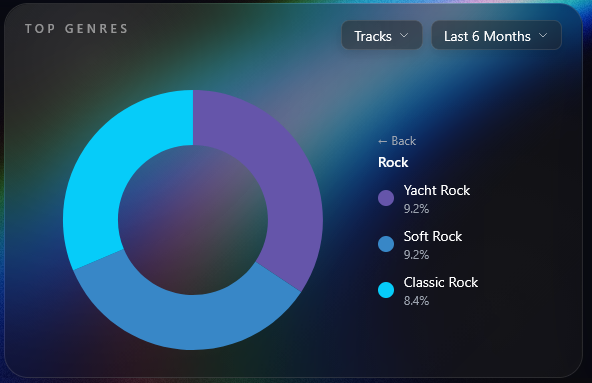

The genre card shows:
- Each genre's percentage of your total listening
- Collapsible subgenres
- An animated horizontal bar chart
- A toggle to switch the data source between **Artists** and **Tracks**

---

### Recently Played

Your last 30 tracks played on Spotify.

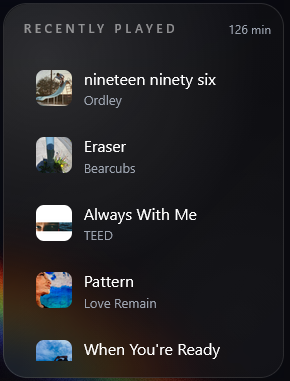

The recently played card shows:
- Track name — links to Spotify
- Artist(s)
- Aggregate listening time across all 30 tracks

---

### Profile Cards

At any point on the dashboard, clicking an artist photo or album cover opens a profile card with more detail.

**Artist card**

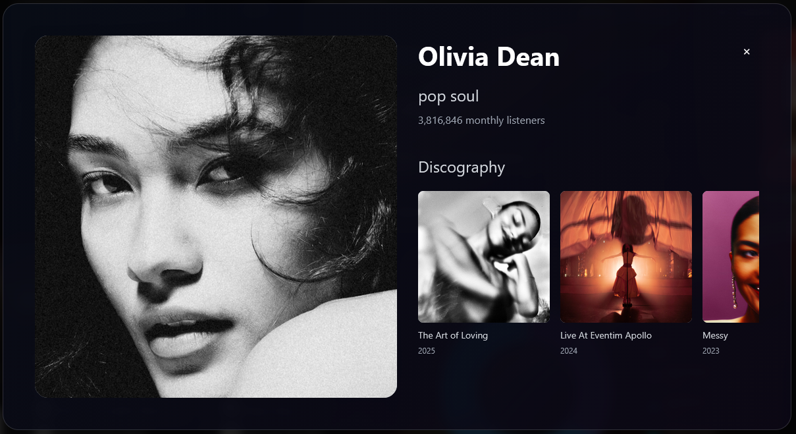

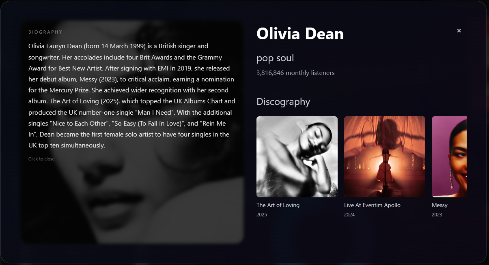

- Artist name — links to Spotify
- Artist photo
- Primary genre
- Monthly listener count
- Popularity score (0–100)
- Top 10 tracks on expand

**Album card**

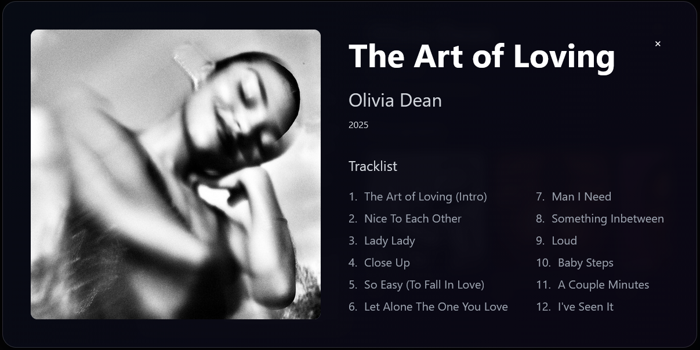

- Album image
- Album name
- Artist name
- Release year
- Full track list

---

## Notes

- All sections load from a single API call to `/api/user-stats` on page load.
- Switching time ranges does not re-fetch from Spotify — data for all three ranges is loaded upfront.