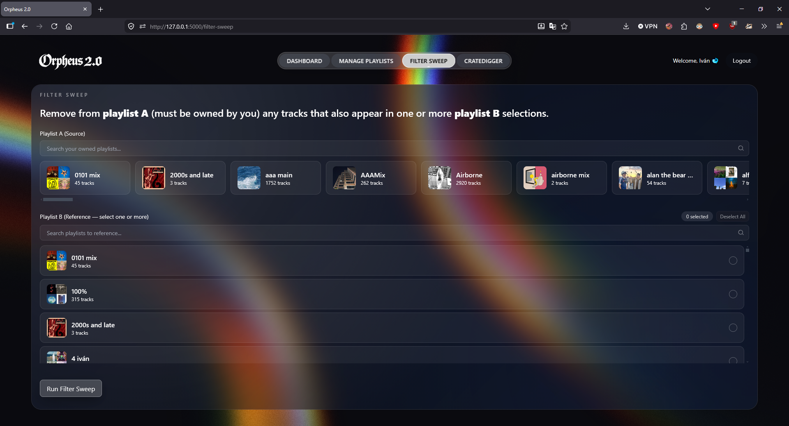
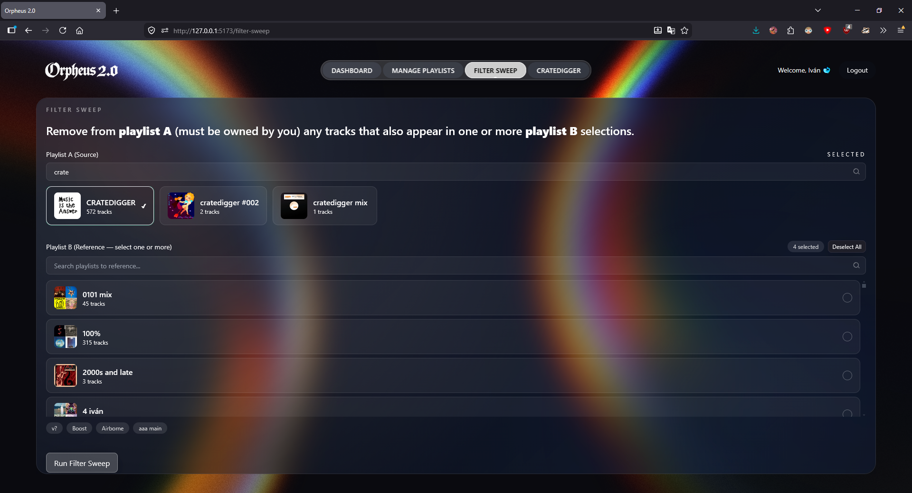
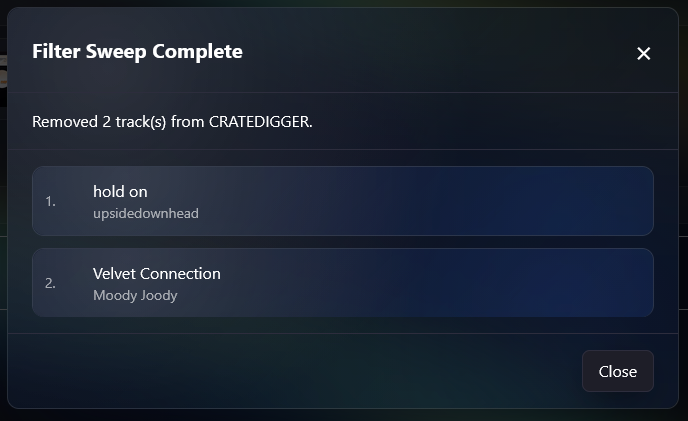

# Filter Sweep

Filter Sweep removes tracks from one playlist that already exist in one or more other playlists — keeping your library distinct and free of overlap.

---

## How It Works

1. Choose a **Source Playlist** (Playlist A) — must be a playlist you own.
2. Choose one or more **Reference Playlists** (Playlist B) — any playlist you own or follow.
3. Filter Sweep identifies every track in Playlist A that also appears in any of the reference playlists.
4. Those tracks are removed from Playlist A.

Matching is done by **Spotify URI**, so only exact track versions are matched — name variants and alternate releases are not affected.

---

## Example Workflow

Here's how Filter Sweep fits into a real curation workflow:

Spotify's *Discover Weekly* refreshes every Monday with new recommendations. Rather than deciding on the spot whether to keep each track, you can copy everything into a dedicated staging playlist — in this case, one called *CRATEDIGGER* — and evaluate at your own pace.

As you listen and find tracks you like, you add them to your main playlists. Then, run Filter Sweep with *CRATEDIGGER* as the source and your main playlists as references. Any tracks you've already promoted get removed from the staging playlist automatically, keeping it clean and focused on what still needs review.

This turns a weekly inbox of 30 recommendations into a manageable, self-maintaining queue — no manual cross-referencing required.

---

## Selecting Playlists

**Source Playlist (Playlist A)**
- Displayed as a horizontally scrollable carousel
- Searchable by name
- Single select only

**Reference Playlists (Playlist B)**
- Displayed as a searchable list with checkboxes
- Multi-select — pick as many as you need
- Selected playlists appear as chips below the list
- **Deselect All** button to clear your selection at once

---

## Results

After the sweep runs, a summary is displayed showing:

- How many tracks were removed from Playlist A
- A full list of removed tracks, each with:
  - Track name
  - Artist(s)
  - How many copies appeared in Playlist A (all copies are removed, not just one)

---

## Notes

- **All copies** of a matching track are removed from Playlist A — if a track appears more than once, every instance is cleared.
- Filter Sweep only ever modifies Playlist A. Reference playlists are never changed.
- Playlist A must be a playlist you own. Reference playlists can be playlists you own or follow.
- If there is no overlap between Playlist A and your selected references, no changes are made and nothing is modified.
