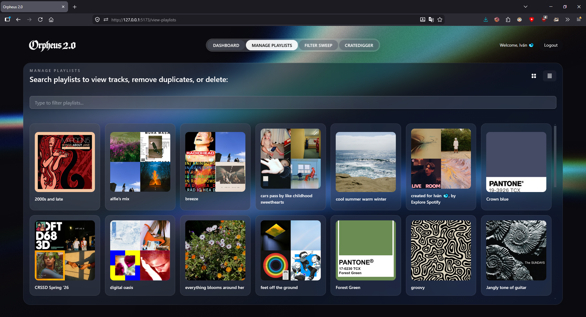
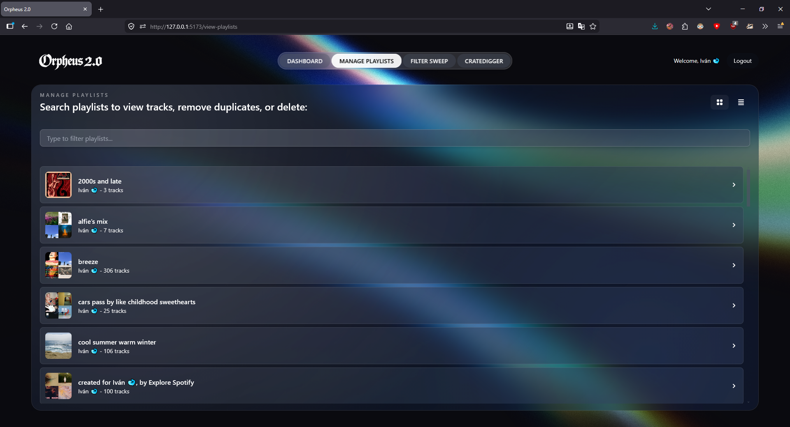
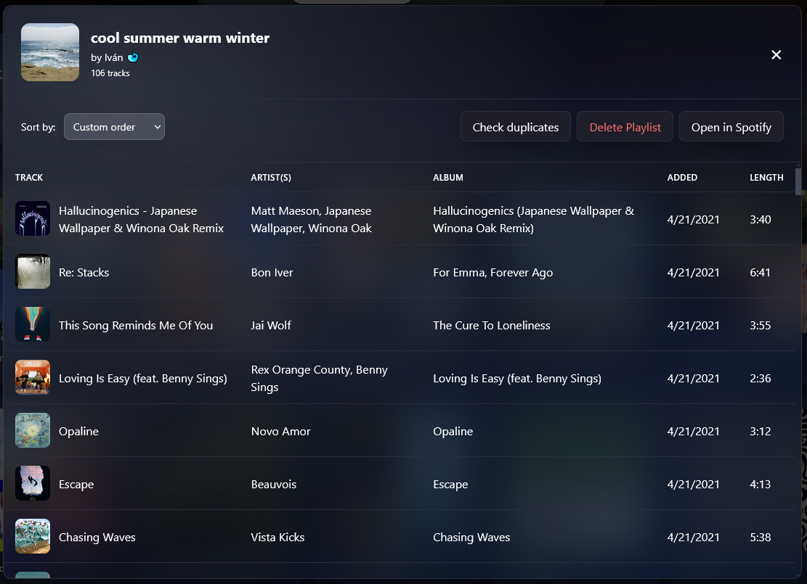
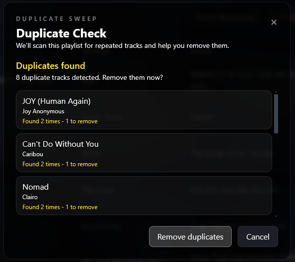

# Manage Playlists

Manage Playlists lets you browse every playlist you own, inspect its full track list, and clean it up by removing duplicate tracks.

---

## Browsing Playlists

Playlists load in two views — switch between them at any time.

**Grid View** — thumbnail layout, good for visual browsing.



**List View** — compact rows with more metadata at a glance.



### Search & Filter

Type in the search bar to filter playlists by name in real time.

---

## Track Details

Click any playlist to open its full track list. Large playlists load in the background in batches of 100.



Sorting options inside a playlist:
- Custom order (default)
- Recently added
- A–Z / Z–A
- By artist
- By album

---

## Remove Duplicates

Detects and removes duplicate tracks from any playlist you own.



### How Duplicates Are Detected

Tracks are compared using a normalized canonical key rather than their raw names. This catches variants that look different on the surface but represent the same song — live versions, remasters, and featured artist permutations.

| Step | Input | Output |
|---|---|---|
| Lowercase | `Song Name (Live)` | `song name (live)` |
| Strip brackets | `song name (live)` | `song name` |
| Strip suffixes | `song name – Remastered 2011` | `song name` |
| Strip feat. | `song name feat. Drake` | `song name` |
| Normalize artists | `["Drake", "21 Savage"]` | `21 savage & drake` |

The final key used for comparison:
```
song name||21 savage & drake
```

Tracks that share a canonical key are grouped together. The **first occurrence** is kept; all subsequent copies are removed.

---

## Notes

- Remove Duplicates is only available for playlists you own.
- Removals are processed in batches of 100 via the Spotify API.