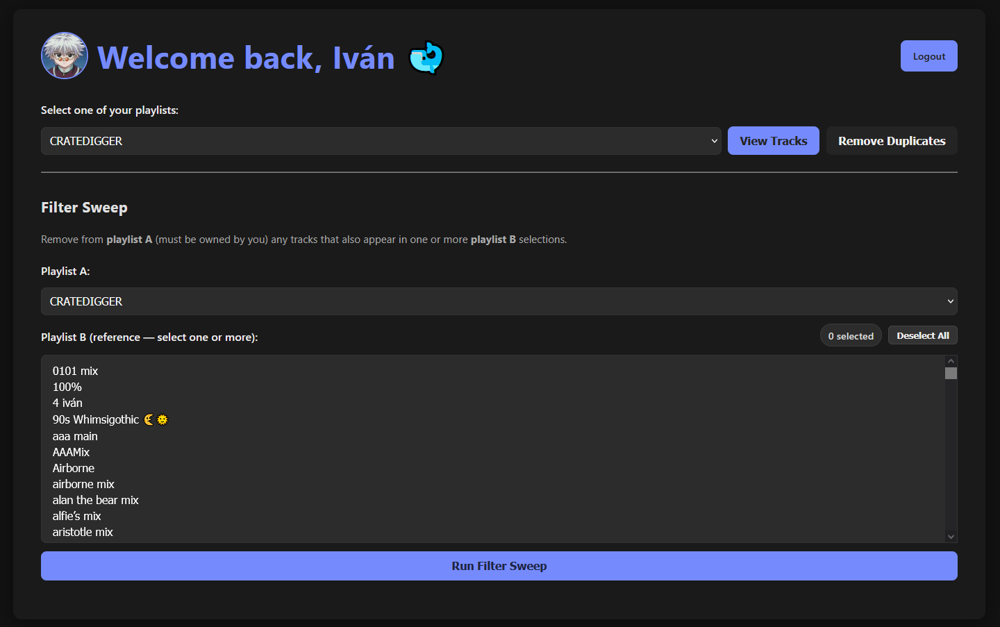
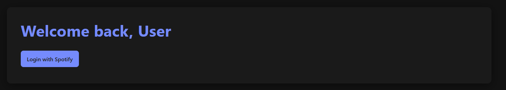
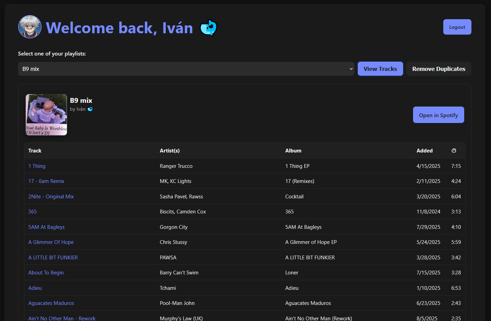
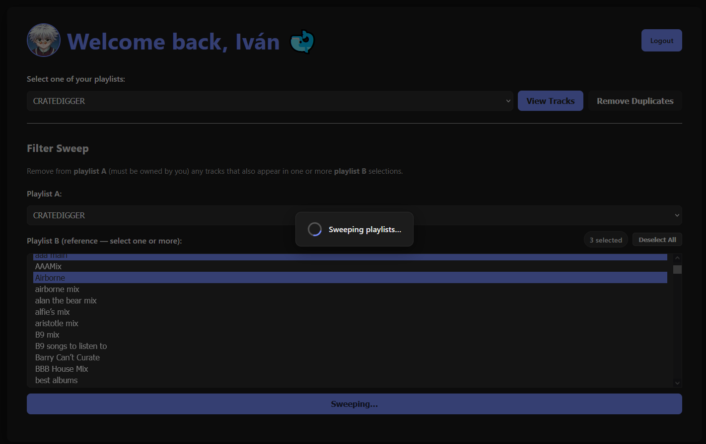

# Orpheus 2.0

**Orpheus 2.0** is a Spotify-powered playlist management app built with Flask and Spotipy.  
It allows you to log in with your Spotify account, view and manage your playlists, clean up duplicates, and perform intelligent “filter sweeps” between playlists — all from a clean and responsive interface.

**Home Page**


## Features

### Playlist Tools
- **View any playlist** you own or follow
- **See track details** (title, artist, album, explicit, added date)

### Smart Cleaning
- **Remove Duplicates** — detects true duplicates even if names differ slightly (e.g. “Song Name – Remastered 2011” vs “Song Name”)
- **Filter Sweep** — remove songs from Playlist A that appear in one or more Playlist B selections

### Recently Played
- View your **Recently Played** tracks via the Spotify API (requires `user-read-recently-played` scope)
- Treated like a pseudo-playlist in the interface

### UI & Usability
- Responsive layout that scales with window size (no horizontal scroll)
- Playlist cover image and owner info aligned neatly beside the title
- Profile picture and “Welcome” header that link back home
- AJAX-driven updates — no page reloads when viewing playlists
- Accessibility-friendly flash messaging and ARIA labels

## Screenshots
**Log in Page**


**Home Page**


**Viewing Tracks**


**Filter Sweep in action**



## Tech Stack

- **Python 3.9+**
- **Flask** – web framework  
- **Spotipy** – Spotify Web API client  
- **Requests**, **dotenv** – environment/config helpers  
- **HTML + CSS + Vanilla JS** – front-end logic  

---

## Spotify API Setup

You’ll need a Spotify Developer App to get credentials.

1. Go to [Spotify for Developers](https://developer.spotify.com/dashboard/applications)
2. Create a new application
3. Add a **Redirect URI**:  
```

[http://127.0.0.1:5000/callback](http://127.0.0.1:5000/callback)

````
4. Copy your **Client ID** and **Client Secret**

Create a `.env` file in the project root:

```env
SPOTIPY_CLIENT_ID=your_spotify_client_id
SPOTIPY_CLIENT_SECRET=your_spotify_client_secret
SPOTIPY_REDIRECT_URI=http://127.0.0.1:5000/callback
FLASK_SECRET_KEY=your_random_secret_key
````

---

## Installation

Clone and set up dependencies:

```
git clone https://github.com/yourusername/orpheus-2.0.git
cd orpheus-2.0
python -m venv venv
source venv/bin/activate  # on Windows: venv\Scripts\activate
pip install -r requirements.txt
```

---

## Running the App

Start the Flask development server:

```
python app.py
```

Then open in your browser:

```
http://127.0.0.1:5000/
```

Click **Login with Spotify** and authorize the app.

---

## Usage

### Home Screen

* Shows your Spotify profile picture and name
* Dropdowns for selecting playlists
* Option to **View Tracks** or **Remove Duplicates**
* Filter Sweep tools below (optional)

### Playlist View

* Displays track list with titles, artists, albums, and links
* Automatically sorted A→Z
* Shows playlist cover art next to title
* Displays “by {user}” aligned with title

### Filter Sweep

* Select **Playlist A** (must be owned by you)
* Select one or more **Playlist B** entries (reference playlists)
* Removes any overlapping tracks from Playlist A

### Remove Duplicates

* Click “Remove Duplicates” on any owned playlist
* The app:

  * Fetches all tracks with their positions
  * Canonicalizes titles and artists (ignores remix/feat/remaster variants)
  * Keeps first appearance, removes others
  * Displays how many duplicates were removed

---

## Permissions Required

Your Spotify scopes include:

```
playlist-read-private
playlist-read-collaborative
playlist-modify-private
playlist-modify-public
user-read-recently-played
```

> If you receive “Insufficient client scope” errors, log out and reauthorize — this happens when Spotify tokens were issued before new scopes were added.

---

## Duplicate Detection Logic (Simplified)

Duplicates are detected using **canonicalization**:

| Step              | Example                                        | Result             |
| ----------------- | ---------------------------------------------- | ------------------ |
| Lowercase         | `Song Name (Live)`                             | `song name (live)` |
| Remove brackets   | `song name (live)` → `song name`               |                    |
| Remove suffixes   | `song name – remastered 2011` → `song name`    |                    |
| Remove “feat.”    | `song name feat. Drake` → `song name`          |                    |
| Normalize artists | `[“Drake”, “21 Savage”]` → `21 savage & drake` |                    |

Final key:

```
"song name||21 savage & drake"
```

Tracks with the same key are grouped, first kept, others removed.


## Development Notes

* Flask runs with `debug=True` for development; disable it in production.
* To avoid 403 on “Recently Played”, ensure your token includes the `user-read-recently-played` scope.
* Playlist operations that modify data are **restricted to playlists you own** for safety.

---

## Future Enhancements

* “Merge Playlists” feature (combine A+B without duplicates)
* “Duration / BPM filters” for advanced curation
* Export / import playlists to CSV
* Better error modals instead of alert boxes

---

## License

MIT License © 2025 Ivan Rodriguez Ruelas
