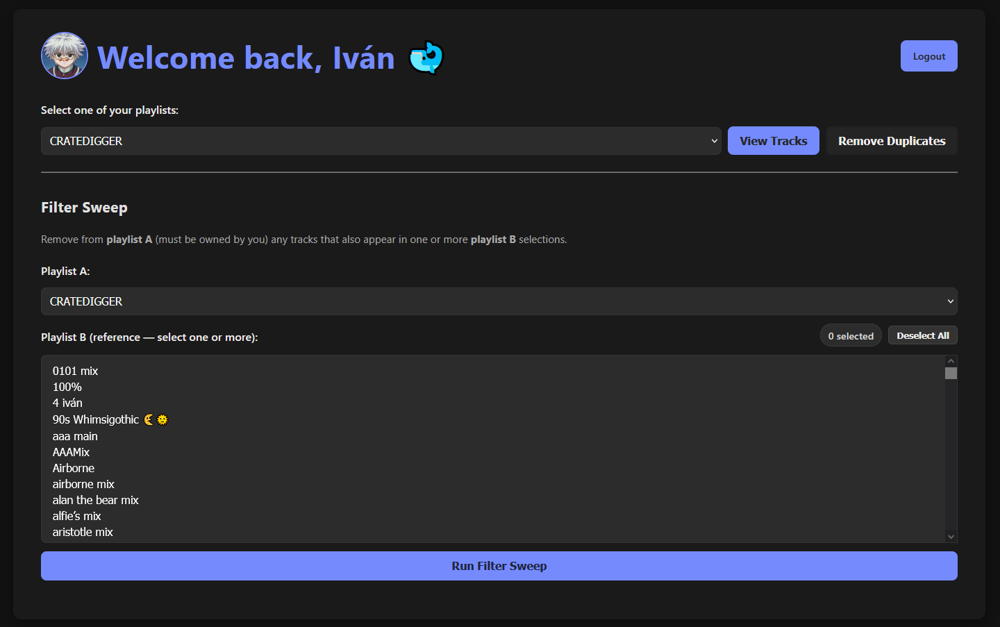
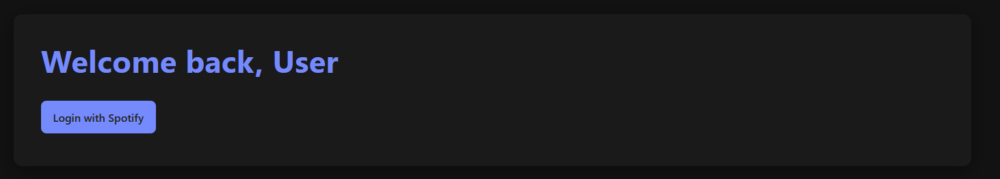
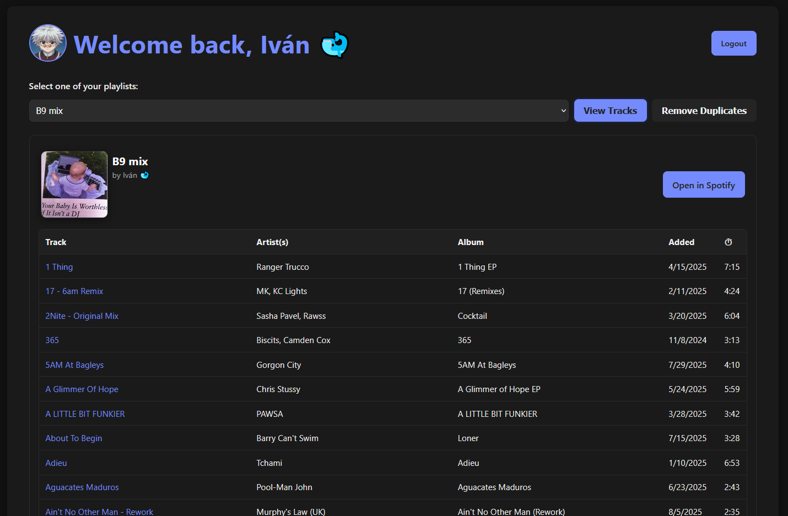
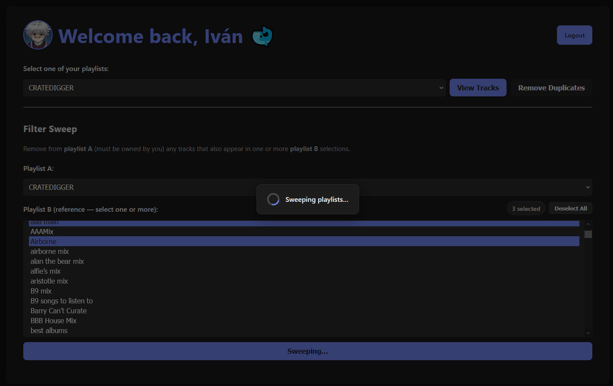

# Orpheus 2.0

> A Spotify-powered playlist management and music discovery app built with Flask + React.



---

## What It Does

Orpheus connects to your Spotify account and gives you a set of tools that the official Spotify app doesn't — smarter playlist cleaning, cross-playlist filtering, listening stats, and the ability to download your playlists as MP3s for offline or DJ use.

---

## Tools

### Dashboard
Your listening stats at a glance. See your top artists, top tracks, and top genres across three time ranges (Last 4 Weeks, Last 6 Months, All Time), plus your recently played history.

### View Playlists
Browse any playlist you own or follow. View full track details — title, artist, album, explicit flag, and date added.

### Remove Duplicates
Detects and removes duplicate tracks from any playlist you own. Duplicates are found by canonicalizing each track's title and artist before comparison, so variants like *"Song Name – Remastered 2011"* and *"Song Name"* are correctly identified as the same track. See [how it works](#duplicate-detection).

### Filter Sweep
Remove songs from one playlist (Playlist A) that already appear in one or more reference playlists (Playlist B). Useful for keeping playlists distinct from each other. See [how I use it](#how-i-use-filter-sweep).

### USB Pod
Download any playlist as MP3s to a local folder. Tracks are sourced from YouTube via yt-dlp and automatically tagged with title, artist, and cover art. **DJ Mode** searches for extended versions of tracks when available.

> **Requires ffmpeg** to be installed and on your system PATH. The Docker setup handles this automatically.

### Crate Digger *(currently paused)*
Crate Digger was a music discovery tool powered by Spotify's recommendations endpoint — that endpoint has since been deprecated by Spotify. A replacement experience is in the works.

---

## Screenshots

**Login**


**Dashboard**


**Playlist View**


**Filter Sweep**


---

## Tech Stack

| Layer | Technologies |
|---|---|
| Backend | Python 3.12, Flask, Spotipy, yt-dlp, mutagen, Gunicorn |
| Frontend | React 18, React Router, Vite, Tailwind CSS |
| Visualization | Recharts, GSAP, Motion, Three.js |
| Infrastructure | Docker, ffmpeg |

---

## Getting Started

### 1. Spotify Developer Setup

Before running the app you need a Spotify Developer application.

1. Go to the [Spotify Developer Dashboard](https://developer.spotify.com/dashboard/applications) and create a new app
2. Under **Redirect URIs**, add: `http://127.0.0.1:5000/callback`
3. Copy your **Client ID** and **Client Secret**

Create a `.env` file in the project root:

```env
SPOTIPY_CLIENT_ID=your_client_id
SPOTIPY_CLIENT_SECRET=your_client_secret
SPOTIPY_REDIRECT_URI=http://127.0.0.1:5000/callback
FLASK_SECRET_KEY=any_random_secret_string
```

### 2. Running with Docker *(recommended)*

```bash
docker compose up --build
```

Docker handles Python dependencies, Node, ffmpeg, and Gunicorn automatically. The app is served at http://localhost:5000.

```bash
docker compose down          # stop
docker compose down -v       # stop and clear cached Spotify tokens
```

### 3. Running Locally

```bash
# Clone
git clone https://github.com/bhance79/Orpheus-2.git
cd Orpheus-2

# Backend
python -m venv venv
source venv/bin/activate       # Windows: venv\Scripts\activate
pip install -r requirements.txt

# Frontend
npm install
npm run build

# Start
python app.py
```

Open http://127.0.0.1:5000 and click **Login with Spotify**.

### 4. Development Mode (hot reload)

```bash
# Terminal 1 — Flask backend
python app.py

# Terminal 2 — Vite dev server (port 5173)
npm run dev
```

Flask auto-detects the Vite dev server and redirects there after login so you get hot module replacement during development.

---

## How I Use Filter Sweep

<!-- Share your personal Filter Sweep workflow here. For example:
  - What you use as Playlist A (the one you want to clean)
  - What you use as reference playlists (Playlist B)
  - Your broader curation strategy or use cases
-->

---

## Duplicate Detection

Duplicates are identified by reducing each track to a canonical key before comparison:

| Step | Input | Output |
|---|---|---|
| Lowercase | `Song Name (Live)` | `song name (live)` |
| Strip brackets | `song name (live)` | `song name` |
| Strip suffixes | `song name – Remastered 2011` | `song name` |
| Strip feat. | `song name feat. Drake` | `song name` |
| Normalize artists | `["Drake", "21 Savage"]` | `21 savage & drake` |

The final key used for comparison:
```
song name||21 savage & drake
```

Tracks that share a key are grouped. The earliest occurrence is kept; all others are removed.

---

## Spotify Permissions

| Scope | Used For |
|---|---|
| `playlist-read-private` | Reading your playlists |
| `playlist-read-collaborative` | Reading collaborative playlists |
| `playlist-modify-private` | Editing private playlists |
| `playlist-modify-public` | Editing public playlists |
| `user-read-recently-played` | Recently Played feed |
| `user-top-read` | Top artists, tracks, and genre stats |

> If you see an "Insufficient client scope" error, log out and log back in — your existing token was issued before a new scope was added.

---

## Notes

- Write operations (Remove Duplicates, Filter Sweep) are restricted to playlists you own.
- Set `FLASK_DEBUG=1` in your environment to enable Flask debug mode. Never use this in production.
- Spotify token refresh is handled automatically. If you're ever stuck in a bad auth state, log out and back in.

---

## Roadmap

- [ ] Merge Playlists — combine two playlists without duplicates
- [ ] BPM / duration filters for advanced curation
- [ ] Export playlists to CSV
- [ ] Crate Digger v2 — rebuilt without the deprecated recommendations endpoint

---

## License

MIT License © 2025 Ivan Rodriguez Ruelas
