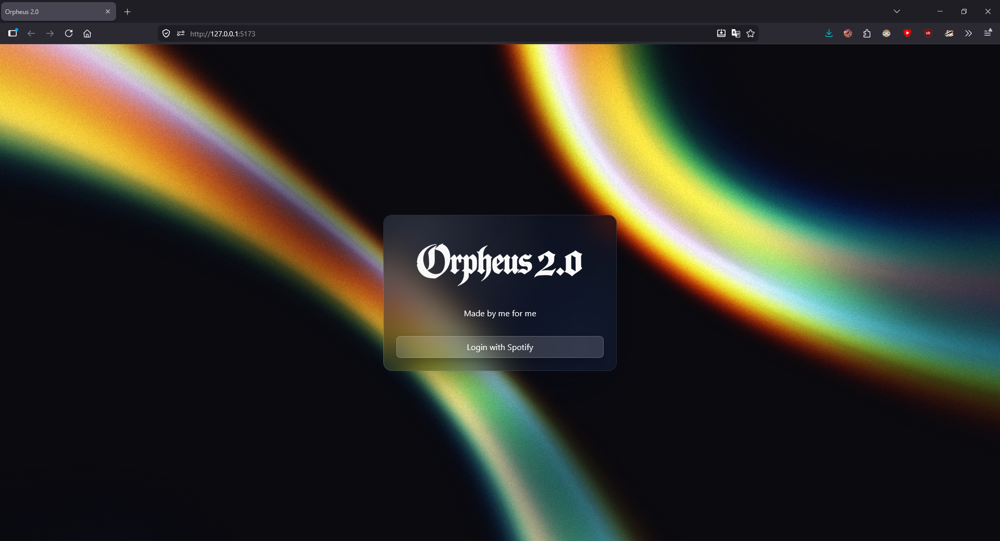
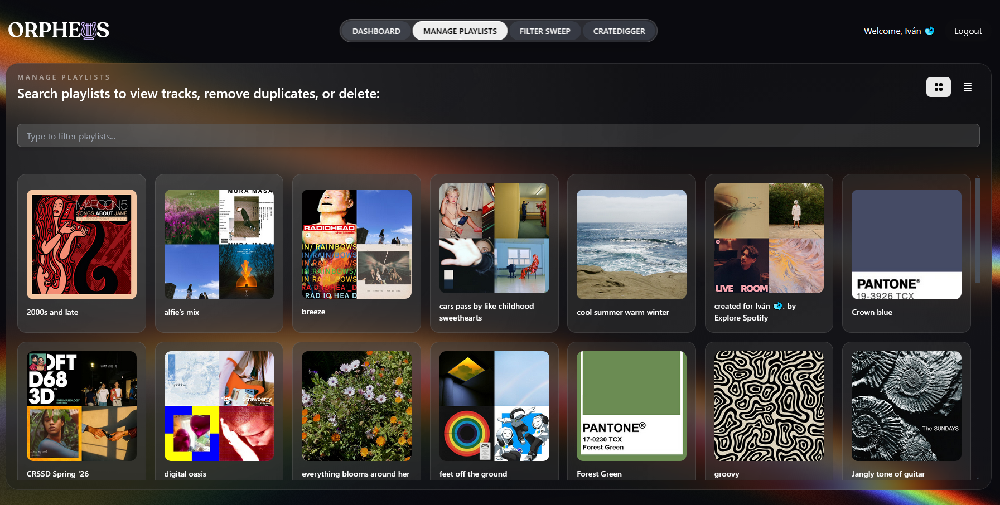
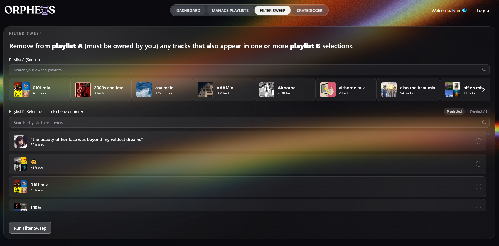

# Orpheus 2.0

> A Spotify-powered playlist management and music discovery app built with Flask + React.


---

## What It Does

Orpheus 2.0 connects to your Spotify account and gives you a set of tools the official Spotify app doesn't — smarter playlist cleaning, cross-playlist filtering, and detailed listening stats.

---

## Tools

### Dashboard
Your listening stats at a glance — top artists, top tracks, top genres across three time ranges, and your recently played history. — [See how it works](DASHBOARD.md)

### Manage Playlists
Browse any playlist you own or follow, inspect its full track list, and remove duplicate tracks. — [See how it works](MANAGE_PLAYLISTS.md)

### Filter Sweep
Remove tracks from one playlist that already appear in one or more reference playlists — useful for keeping your library distinct and overlap-free. — [See how it works](FILTER_SWEEP.md)

### Crate Digger *(currently paused)*
Crate Digger was a music discovery tool powered by Spotify's recommendations endpoint. That endpoint has since been deprecated by Spotify, and a replacement experience is in the works.

---

## Screenshots

**Login**



**Dashboard**


<div align="right">

[See more](DASHBOARD.md)

</div>

**Manage Playlists**


<div align="right">

[See more](MANAGE_PLAYLISTS.md)

</div>

**Filter Sweep**


<div align="right">

[See more](FILTER_SWEEP.md)

</div>

---

## Tech Stack

| Layer | Technologies |
|---|---|
| Backend | Python 3.12, Flask, Spotipy, yt-dlp, mutagen, Gunicorn |
| Frontend | React 18, React Router, Vite, Tailwind CSS |
| Visualization | Recharts, GSAP, Motion, Three.js |
| Infrastructure | Docker, ffmpeg |

---

## Getting Started

### 1. Spotify Developer Setup

Before running the app, you need a Spotify Developer application.

1. Go to the [Spotify Developer Dashboard](https://developer.spotify.com/dashboard/applications) and create a new app.
2. Under **Redirect URIs**, add: `http://127.0.0.1:5000/callback`
3. Copy your **Client ID** and **Client Secret**.

Create a `.env` file in the project root:

```env
SPOTIPY_CLIENT_ID=your_client_id
SPOTIPY_CLIENT_SECRET=your_client_secret
SPOTIPY_REDIRECT_URI=http://127.0.0.1:5000/callback
FLASK_SECRET_KEY=any_random_secret_string
```

### 2. Running with Docker *(recommended)*

```bash
docker compose up --build
```

Docker handles Python dependencies, Node, ffmpeg, and Gunicorn automatically. The app is served at http://localhost:5000.

```bash
docker compose down          # stop
docker compose down -v       # stop and clear cached Spotify tokens
```

### 3. Running Locally

```bash
# Clone
git clone https://github.com/bhance79/Orpheus-2.git
cd Orpheus-2

# Backend
python -m venv venv
source venv/bin/activate       # Windows: venv\Scripts\activate
pip install -r requirements.txt

# Frontend
npm install
npm run build

# Start
python app.py
```

Open http://127.0.0.1:5000 and click **Login with Spotify**.

### 4. Development Mode (hot reload)

```bash
# Terminal 1 — Flask backend
python app.py

# Terminal 2 — Vite dev server (port 5173)
npm run dev
```

Flask auto-detects the Vite dev server and proxies requests there after login, giving you hot module replacement during development.

---

## Spotify Permissions

| Scope | Used For |
|---|---|
| `playlist-read-private` | Reading your private playlists |
| `playlist-read-collaborative` | Reading collaborative playlists |
| `playlist-modify-private` | Editing private playlists |
| `playlist-modify-public` | Editing public playlists |
| `user-read-recently-played` | Recently Played feed |
| `user-top-read` | Top artists, tracks, and genre stats |

> If you see an "Insufficient client scope" error, log out and log back in — your existing token was issued before a new scope was added.

---

## Notes

- Write operations (Remove Duplicates, Filter Sweep) are restricted to playlists you own.
- Set `FLASK_DEBUG=1` in your environment to enable Flask debug mode. Never use this in production.
- Spotify token refresh is handled automatically. If you're ever stuck in a bad auth state, log out and back in.

---

## Roadmap

- Merge Playlists — combine two playlists without duplicates
- BPM / duration filters for advanced curation
- Export playlists to CSV
- Crate Digger v2 — rebuilt without the deprecated recommendations endpoint

---

## License

MIT License © 2025 Ivan Rodriguez Ruelas